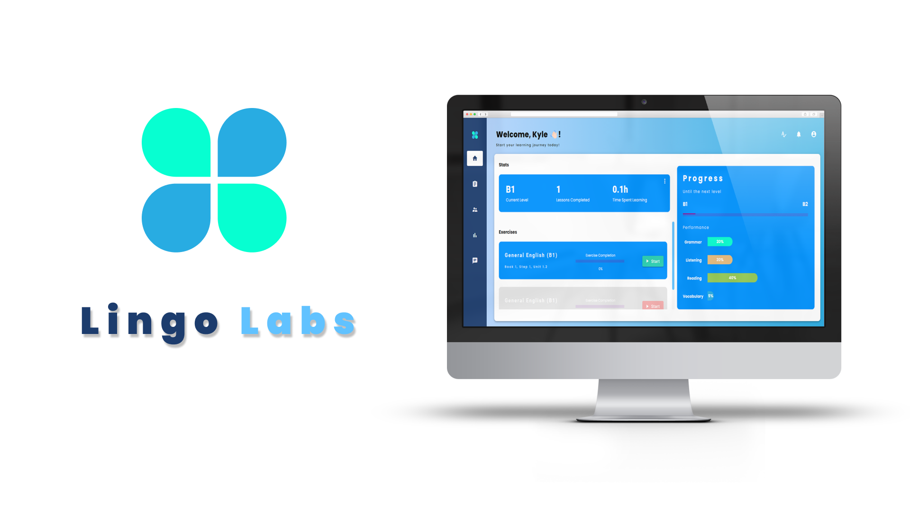

# Lingo Labs

<!-- Repository Information & Links-->
<br />


<!-- HEADER SECTION -->
<h3 align="center">Designed & Developed by:</h3>
<h5 align="center">Kyle  Pharoah</h5>
<h6 align="center">DV 300 | Term 4 | 2023</h6>

<p align="center">
    <a href="https://github.com/xviovx/Nova">
        
    </a>
</p>
  <p align="center">
    An English-learning portal.<br>
   <br />
   <a href="your-demo-link" align="center" align="center">View Demo</a>
    ·
    <a href="https://github.com/xviovx/Lingo_Labs/issues" align="center">Report Bug</a>
    ·
    <a href="https://github.com/xviovx/Lingo_Labs/issues" align="center">Request Feature</a>
</p>
<!-- TABLE OF CONTENTS -->

## Table of Contents

- [Description](#description)
- [Built With](#built-with)
- [Installation](#installation)
- [Features and Functionality](#features-and-functionality)
- [Authors](#authors)
- [Acknowledgements](#acknowledgements)

<br>



### Description

Lingo Labs aims to make language learning more accessible, engaging, and effective. It's designed for learners who seek a more interactive and personalized approach to mastering a new language. The platform caters to users of various skill levels, from beginners to advanced learners, and supports their journey with tailored exercises and activities.

### Built With

* [Angular](https://angular.io/)
* [Firebase](https://firebase.google.com/)
* [Angular Material](https://material.angular.io/)
* [RxJS](https://rxjs.dev/) 

### Installation

Follow these steps to get this project running on your machine:

1. **Clone the Repository** 

    Run the following command in your terminal to clone the project:
    ```sh
    git clone https://github.com/xviovx/Lingo_Labs.git
    ```

2. **Open the Project** 

    Open VS Code, select `File | Open...` from the menu, navigate to the cloned directory, and press `Open`.

3. **Install Dependencies** 

    ```sh
    npm install
    ```

4. **Set Up Firebase** 

    To allow the app to securely connect to your Firebase project, a configuration file must be downloaded and added to your project. Follow the instructions provided in the [Firebase Console](https://console.firebase.google.com/).

5. **Additional dependencies** 

    Install any additional dependencies listed in the package.json file.

5. **Run the server for the Chatbot** 

    Run the Flask server from: https://github.com/xviovx/LL_server
  

<!-- FEATURES AND FUNCTIONALITY-->
## Features and Functionality


<!-- AUTHORS -->
## Authors

- **Kyle Pharoah** - [xviovx](https://github.com/xviovx)

<!-- ACKNOWLEDGEMENTS -->
## Acknowledgements

* [Angular Docs](https://angular.io/docs)
* [Firebase Docs](https://firebase.google.com/docs)
* [Angular Material Docs](https://material.angular.io/components/categories)
* [StackOverflow](https://stackoverflow.com/)
* [OpenAI Docs](https://platform.openai.com/docs/introduction)


